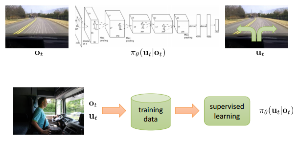
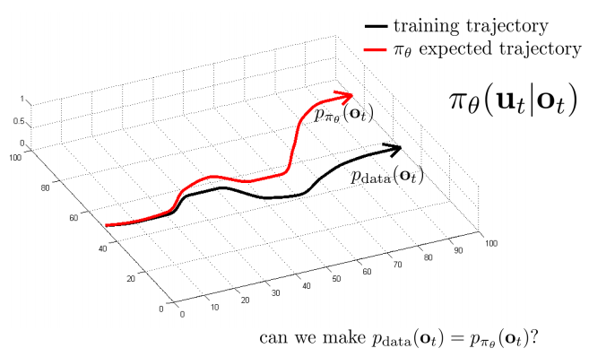
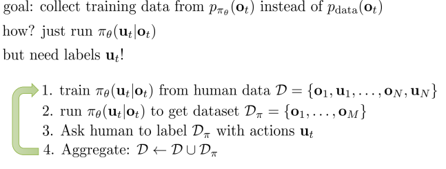

# Supervised Learning of Behaviors:  
## Deep Learning, Dynamical Systems, and Behavior Cloning

| 课程名称 | CS 294: Deep Reinforcement Learning, Spring 2017 | 
| ------- | ---------------------------------- |
| 授课单位 | Stanford University |
| 授课者   | Sergey Levine      |  
| 课程资料 | http://rll.berkeley.edu/deeprlcourse/ |
| 章节名称 | Supervised Learning of Behaviors: Deep Learning, Dynamical Systems, and Behavior Cloning |
| 参考资料 | http://rll.berkeley.edu/deeprlcourse/docs/week_2_lecture_1_behavior_cloning.pdf |

## 术语及符号标记

## 模仿学习(Imitation Learning)

### 这种方法能够工作吗？不能！

由图中可以看出，期望轨道和训练轨道之间的差异越来越大，原因是得到的模型中模型输出与实际输出总有一定误差，如果一直以测试路径进行参考，那么误差就会累积，变得越来越大。
### 这种方法可以工作吗？能！
由英伟达的论文《End to End Learning for Self-Driving Cars》以及提供的视频可知，模仿学习的方法在自动驾驶中确实可以达到很好的效果。

那么就引起了我们的思考，**怎样可以使模仿学习在大多数情况下都能够工作达到满意的效果？**
考虑到期望轨道和训练轨道之间都有自己的分布，我们可以在稳定性上下功夫，也就是说不要让这种模型输出以及实际输出之间的误差增大，因此我们需要在过程中不断发现误差甚至错误，然后及时地对误差进行修正。***关于详细的解决方案，会在学习论文之后解决***。
另外一方面，为了使训练数据概率分布和期望概率分布相等，我们的想法是每次直接采用期望数据的概率分布进行行动？？***此处不是太理解***。
因此我们引入了**DAgger(Dataset Aggregation)**
### DAgger

### 模型学习小结
#### 自身通常不足
1. 分布不匹配问题

#### 有时工作良好
1. Hacks(e.g.left/right images)
2. Samples from a stable trajectory distribution
3. Add more on-policy data, e.g. using DAgger
## 疑难问题 
1. DAgger 算法中第二步如何实现？
2. 是否可以认为模仿学习就是一种监督学习 
