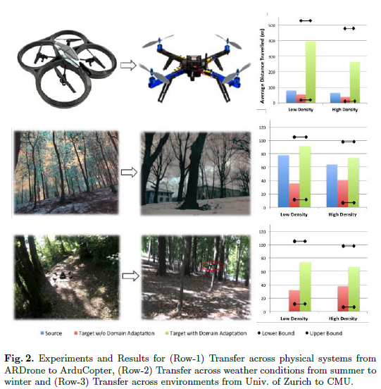

#  Learning Transferable Policies for Monocular Reactive MAV Control
|               | Learning Transferable Policies for Monocular Reactive MAV Control |
| ------------- | -------------            |
| 作者信息 | Shreyansh Daftry, J. Andrew Bagnell, Martial Hebert  |
| 发表情况 | Submitted on 1 Aug 2016 on arXiv, ISER 2016      |
| 被引次数 | 2 until 20170208             |
| 阅读时间 | 2017年2月9日              |
| 论文领域 | Transfer Learning, Domain Adaptation, Reactive Control, Autonomous Monocular Navigation, MAV |  
| 技术难点 | 小径与周围环境像素融合较好，使用传统的基于像素差异的方法进行小径识别难以有好的效果       |
| 主要创新 | 实现了 基于DNN的小径感知技术，并提供了实验数据集以及视频进行支撑 |

## 原文摘要
迁移从先前任务获得的知识到下一个任务的能力是人类学习最为重要的机制。尽管如此，能够在一个部分相似的环境中适应自主行为仍然是机器人研究中一件棘手的事情。在这篇文章中，我们朝着这个方向前进了一小步：提出了一个学习可迁移的行为的策略的通用框架。我们的目标是通过使用源域(source domain)中的训练数据来解决与源域不同但是相关的目标域中的学习问题。我们通过使用monocular reactive control的自主微型飞行器(MAV--Micro Aerial Vehicles)以及通过大量的实地的户外复杂环境的飞行试验来呈现我们提出方法的成果。

## 总体思路 

