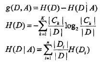

# 决策树模型
分类决策树模型是表示基于特征对实例进行分类的树形结构。
决策树可以转换为一个if-then规则的集合，也可以看做是定义在特征空间划分上的类的条件概率分布。其中，每一个叶节点就表示一个类。
# 决策树学习
决策树学习的目的是构建一个与训练数据拟合很好，并且复杂度小的决策树。
由于从可能的决策树中直接选择最优决策树是NP完全问题，现实中常采用启发式方法学习次优的决策树。什么是启发式方法？？？
# 决策树算法
决策树算法由三部分构成：
- 特征选择
- 树的生成
- 树的剪枝

常用的算法由ID3, C4.5，CART

## 特征选择
特征选择部分中往往只留下对训练数据有足够分类能力的特征。
常用的特征选择的准则有：
### 信息增益(ID3)
其表示的是样本集合D对特征A的信息增益, 其被用于ID3算法中。

